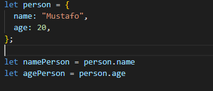
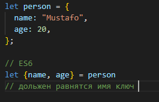
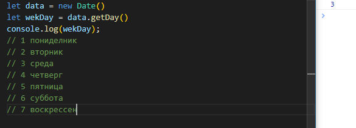

# Объект
## Объекты  JS очень похожи на массивы, но для доступа к элементам объектов испоьзуются строки, а не число. Эти строки нахывают ключами или свойствами а элементы которые им соответствуют- значениями. В месте ты фргменты информации образуют пари ключ-значение 
 Причем  если  массивы используются  главным образом как списки, хранящие множество элементов,  то  объекты часто применяют как одиночные сущности  с множеством характеристик,  или  атрибутов. 
#Созданые объектов
## Для хранения  всевозможной информации  об  одном человек подойдет JavaScript-объект.  Вот пример  объекта,  где хранятся  сведения  о человек по имени John и его возраст 20.

Мы  создали переменную под названием person и присвоили ей  объект с двумя парами  «ключ-значение» (имя и возрасть). При создании  объекта  используются  фигурные скобки  {}  вместо  квадратных, к которым мы  привыкли,  создавая  массивы.
JavaScript знает,  что ключи всегда  строковые, поэтому можно обходиться  без кавычек.  В этом случае имена ключей  должны  соответствовать  тем же правилам, что и имена переменных: например, в них не должно быть  пробелов. Но если  ключ указан  в кавычках,  пробелы в его имени допустимы: 

#Методы объекта в JavaScript
1. Object.entries(obj) -> делаеть все свойствы объекта(obj) отдельный массив

2. Object.keys(obj) -> возвращает массив из все ключи объекта obj

3. Object.values(obj) -> Возврашает все значение в формат массива

# Доступ  к  значениям  внутри  объектов

1. Хранящиеся  в объектах  значения  можно получить  с помощью квадратных скобок — так же, как элементы  массива. Единственное  различие в том, что вместо  индекса (число) используется  ключ  (строка).

2. Точно так же, как необязательны кавычки при записи  литерала  объекта, их  можно опускать  и при доступе к значениям по ключу.  Однако в этом случае код будет немного другим:

# Деструктуризация объектов
## До ES6

## В ES6

# Spread Object
## это копирование объект в новом объекте

# Ключевое слово this
## Ключевое  слово  this  можно использовать  в теле метода, чтобы обратиться  к объекту,  для которого  этот  метод вызывается. 

# Тыпь Date()
##Тип  Date  в  ECMAScript  основан  на  ранней  версии  java.util.Date.  Даты  хранятся в  нем  как  количество  миллисекунд,  прошедших  с  полуночи  1  января  1970  г.,  согласно  универсальному  временному  коду  (Universal  Time  Code,  UTC).  Благодаря такому  формату  с  помощью  типа  Date  можно  точно  представлять  даты,  отстоящие от 1 января 1970  г. на 285  616 лет. Чтобы создать объект  Date, используйте оператор  new  с  конструктором  Date: let now = new Date();

##Методы для работа с компонентами дата
1. Date.now()  возвращает миллисекунд из 1.01.1970

2. getFullYear()  Возвращает четырехсимвольное значение года (2023,  а не просто 23)

3. getMonth()    Возвращает месяц даты (0 представляет январь, а 11 — декабрь)

4. getDate()  Возвращает день месяца даты (от 1 до 31)

5. getDay()  Возвращает день недели даты как число (0 представляет вос-кресенье, 6 — субботу)

6. getHours()  Возвращает час даты как число от 0 до 23

7. getMinutes()  Возвращает минуты даты как число от 0 до 59

8. getSeconds()  Возвращает секунды даты как число от 0 до 59

>> Методы котооые установляют время

9. setFullYear(год) Задает годдаты. Значения года дольжен содержать четыре цифры

10. setMonth(месяц) Задает месяц даты с отсчетом от 0. Указание числа больше 11 приводит к увеличению значения года

11. setDate(дата) Задает день месяца для даты. если значение даты больше, чем количество дней в месяце, значение месяца увеличивается

